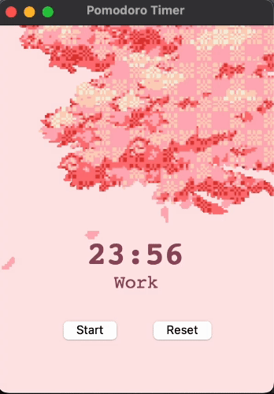

<div align="center"> Cherry Blossom Tree Timer<br/> <br/>  </div>


# Aesthetic Pomodoro Timer

This is a simple Python implementation of the Pomodoro Timer using the Tkinter library for the graphical user interface. The Pomodoro Technique is a time management method developed by Francesco Cirillo in the late 1980s, which uses a timer to break work into intervals, traditionally 25 minutes in length, separated by short breaks and a long break after three short ones.

## Requirements

- Python 3.x
- Tkinter (usually comes pre-installed with Python)

## Usage

1. Clone this repository:

   ```bash
   git clone https://github.com/sepidehkhakzad/PomodoroTimer.git
    ```

2. Navigate to the project directory:

   ```bash
   cd PomodoroTimer
   ```
3. Run the `main.py` script:

   ```bash
   python main.py
   ```
   
4. Click the "Start" button to begin the timer.
5. Click the "Reset" button to reset the timer to its initial state.

## Demo

<p align="center">
  
</p>

## Credits

This project is inspired by the Pomodoro Technique developed by Francesco Cirillo.

## License

This project is licensed under the Apache 2.0 License.


